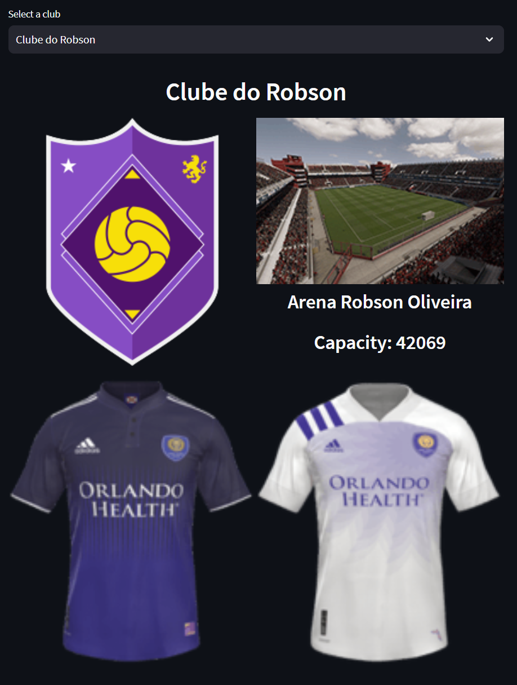
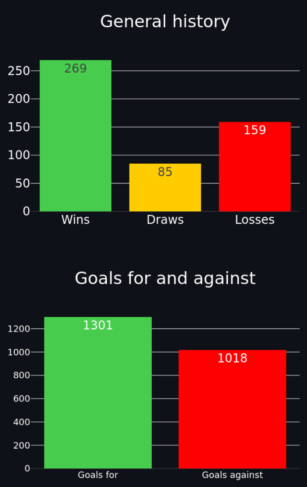
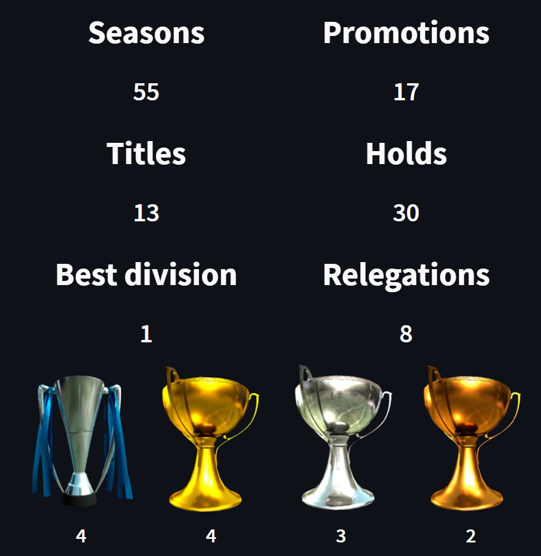
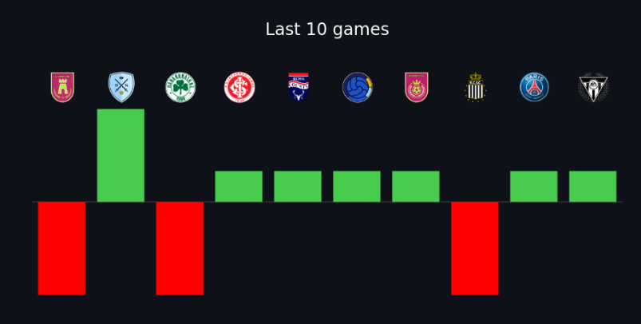
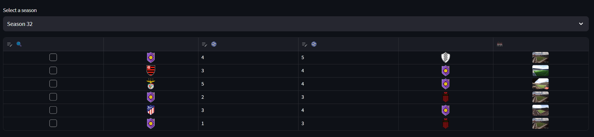
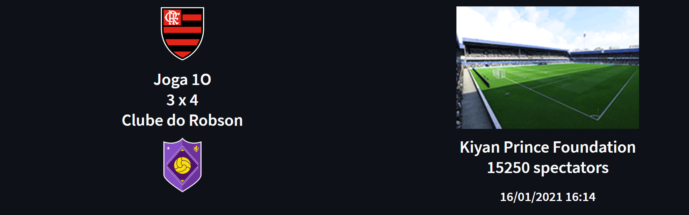
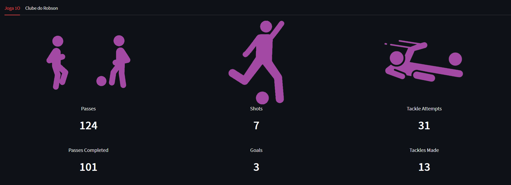
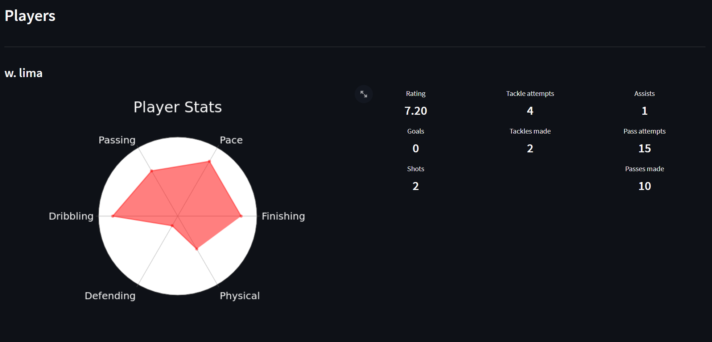
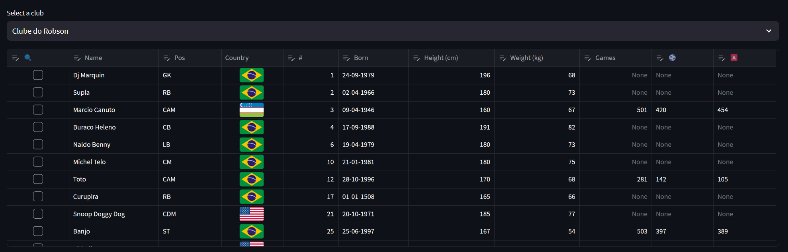
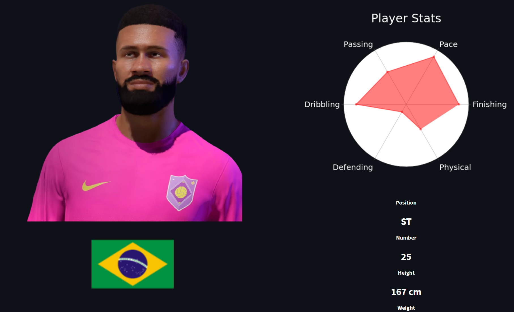

  

<h3 align="center">Pro Clubs - Clube do Robson</h3>

 Project aimed to learn web scraping techniques, data extraction from the FIFA Pro Clubs API and
    data visualization using Streamlit.
      

## 🧐 About 
Welcome to the Pro Clubs - Clube do Robson repository. The main goals of the
project are:

1. Track team performance;
2. Develop skills in data acquisition through API and Web Scraping;
3. Develop skills in database architecture;
4. Develop skills in data processing;
5. Develop skills in data visualization;
6. Develop skills in creating web applications;
7. Document the game's API, which is not officially documented;
8. Document the structure of the created database.

## You can check the webapp for the data scrapped at [Clube do Robson](https://clubedorobson.streamlit.app/).

 ⚠️ Disclaimer: The data can contain some bad words and inappropriate names, since it's the name of the teams and players online, so be aware of that. 

## 🏁 Getting Started 
The FIFA23 game features a mode called Pro Clubs, where each player creates a
virtual player and controls them during matches. The intention of the mode is
to simulate individual participation in a football match, potentially reaching
a 11 vs 11 player situation. Just like in all real-life leagues, the mode has
divisions (in this case 10), each with a minimum score to avoid relegation and
another to progress to the higher division.

## 🖥️ API Documentation 
The game's developer, EA Sports, provides various information about all the
teams created in the mode, as well as all the created players, on their server.
The information is collected through API calls and manipulated in JSON objects.
With this in mind, the idea of this cloud-hosted application/website is to
extract information from the club I play for, save it in a database, and
display it in the browser to develop skills in data acquisition, processing,
and visualization, while tracking the team's performance.

Within each page of each team, we have their information and statistics.
Investigating the requests made by the browser, it is possible to see that the
data comes from an endpoint created by EA which returns them in JSON format.
From there, it becomes easy to obtain the data without the need for Web Scraping.
The API has various paths, which are documented in this Swagger documentation.

- [FIFAProClubsAPI](https://app.swaggerhub.com/apis-docs/pedrochitarra/FIFAProClubsAPI/1.0.0)

In general, we have Clubs, Players, and Matches. Each Club has several Players,
and within each Match, we have the information for each Club and each Player.
Additionally, each Club and Player has their accumulated general statistics.

Season Leaderboard (/seasonRankLeaderboard) provides the top 100 teams of the
current season, in other words, it offers a ranking of who is performing the best.

Clubs Leaderboard (/clubRankLeaderboard) provides the top 100 teams since the
beginning of the game, in other words, the overall ranking of teams.

Club (/clubs/info) provides details about each team, including the shield code,
uniform code, and colors.

Club (/clubs/SeasonalStats) provides club statistics such as wins, losses,
draws, and performance throughout the seasons.

Member (/member/stats) provides statistics for a player within a club, such as
goals, assists, and number of games.

Member (/member/carrer/stats) provides the same information as above, but for
the player's entire career, not just within the same team.

Matches (/clubs/matches) provides statistics for the teams and players involved
in a match.

The API only provides information for the last 5 matches, so each time the game
is run, a CRON job is executed to make the requests and save them in the
database. With this, upon receiving the request responses, the data is saved in
tables of the database, created with Postgres (and SQLite). The front-end of
the application was built using Streamlit to utilize the Python environment.

## 🗄️ Database Documentation 
With the API documentation ready and its models (schemas), it was possible to
create the database architecture. The overview of the architecture is shown
below:

- [Database Schema](https://dbdiagram.io/d/64dd5a2302bd1c4a5ee6db0f)

We have 3 main tables upon which the others depend and have foreign keys: Clubs,
Matches, and Players (which depends on Clubs), representing the structural
divisions of the Streamlit pages. Each of them has a primary key
with the name "ID" for identification. Each Club can have multiple Players,
but each Player belongs to only one Club.

Each Club has several matches, with the information represented in the
ClubsMatches table, which has two foreign keys, one for Clubs and another for
Matches. The same applies to each Player in the PlayersMatches table, which has
two foreign keys, one for Players and another for Matches. Finally, there are
also aggregated information for each Club in each Match in the ClubsMatchesAgg
table.

Each Club has its general information, present in the Seasonals table.

In conclusion, we have 2 tables that do not have a direct relationship with the
others, namely Stadiums and Robsoners. The Stadiums table has the ID and name
of each stadium, but this is not associated with the Club, as any name can be
given to the stadium, even if it exists. The relationship with each stadium
will be explained in the Application section. The Robsoners table presents
the players we created, as the AI controls some players and they do not exist
in the game's API. Some application examples are provided below for
demonstration and the website can be visited at any time.

## 🌐 WebApp for Data Visualization 
With the data recorded, now is the time to create an application to run in the
cloud and display information about our club, as well as matches and players.
The application has 3 main pages, namely: Clubs, Matches, and Players, making
use of the main tables mentioned in the database architecture.

### Clubs
The Clubs page has the following structure for all the teams we face and our own.
It is possible to choose any club we face from the selector and view its
general information.

Club Name, Stadium, Capacity, and Uniforms Used.

For our team, since we run the CRON multiple times, we have more information,
and that's what I'm most interested in.

Overall historical data of the team, such as wins, losses, draws, and performance.

Titles and season history

Last 10 games of the team

### Matches
On this page, each season we played is listed along with the matches within
each season. By clicking on the checkbox next to each match, it's possible
to view its details.

All games for a season

Match details

Match statistics

Players' stats in the match

### Players
On this page, the players from each team we faced, as well as our own players
(which also include information about manually created players), are listed.
Similar to the matches, by clicking on the checkbox next to the player's name,
it's possible to view their details.

All players for a team

Player details and statistics

### Wrapping Up 
This project combines learning important skills for a data scientist with the
fun of playing FIFA. As a result, it was possible to address various stages of
a data pipeline, from acquisition to visualization, all within the same
proposal. I hope you enjoyed it!
